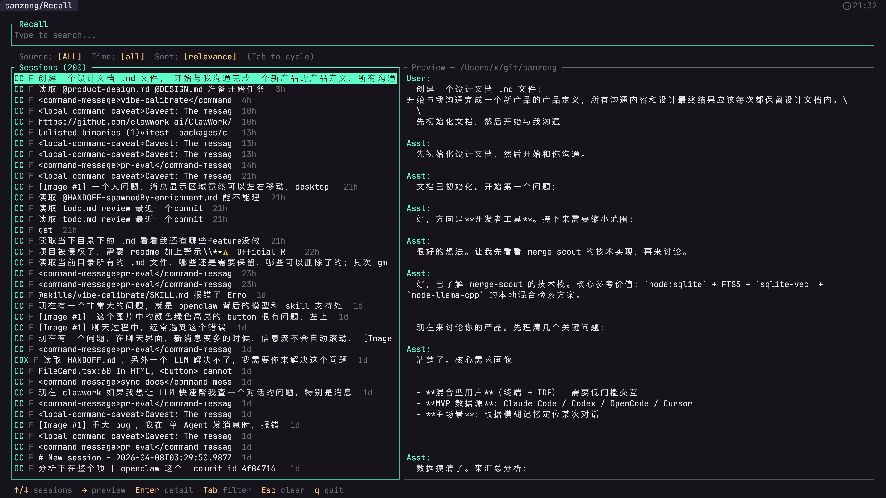

# Recall

Search all your AI coding sessions in one place. Recall indexes conversations from Claude Code, OpenCode, and Codex into a local SQLite database, then lets you search them with a fast TUI powered by hybrid FTS + semantic retrieval.

[](https://asciinema.org/a/909453)

## Install

```bash
brew install samzong/tap/recall
```

Or build from source:

```bash
cargo install --path .
```

Requires Rust 1.85+ (edition 2024).

## Usage

```bash
recall index    # build full index (first run)
recall sync     # incremental update
recall          # launch TUI
```

### TUI

Type to search. Results update in real-time with hybrid ranking: FTS5 keyword matching at message level + semantic vector search at session level, fused via RRF.

- `Tab` — cycle source filter (All / CC / OC / CDX)
- `Enter` — open full conversation
- `y` — copy session to clipboard
- `e` — export session to file
- `q` / `Esc` — back / quit

### CLI Search

```bash
recall search "auth middleware"
recall search "refactor" --source cc --time 7d
```

## Supported Sources

| Source | Label | Data Location |
|--------|-------|---------------|
| Claude Code | CC | `~/.claude/projects/`, `~/.claude/transcripts/` |
| OpenCode | OC | `~/.local/share/opencode/opencode.db` |
| Codex | CDX | `~/.codex/sessions/` |

Missing tools are skipped automatically.

## How It Works

1. **Index** — Adapters scan each tool's local storage, extract sessions and messages
2. **Store** — Sessions and messages go into SQLite with FTS5 full-text indexes
3. **Embed** — Session summaries are embedded locally via multilingual-e5-small (384-dim), stored in sqlite-vec
4. **Search** — Queries hit both FTS5 (keyword) and sqlite-vec (semantic), results fused with Reciprocal Rank Fusion

All data stays local. No API calls, no cloud, no telemetry.

## License

[MIT](LICENSE)
