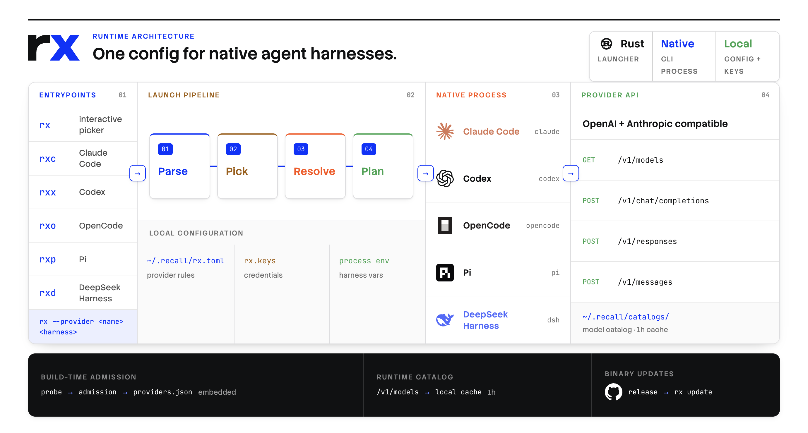

# rx

`rx` launches Claude Code, Codex, OpenCode, Pi, and DeepSeek Harness with one provider configuration. It prepares each harness and runs its native CLI.

[](assets/rx-architecture.png)

## Install

```bash
brew install samzong/tap/recall
```

## Usage

```bash
rx providers login
rx codex
rx --provider openrouter opencode
```

Running `rx` without a harness opens the picker. Arguments after the harness name are passed to that harness.

| Harness | Commands |
| --- | --- |
| Claude Code | `rx claude`, `rxc` |
| Codex | `rx codex`, `rxx` |
| OpenCode | `rx opencode`, `rxo` |
| Pi | `rx pi`, `rxp` |
| DeepSeek Harness | `rx dsh`, `rxd` |

Provider commands:

```bash
rx providers list
rx providers use <provider>
rx providers models update [provider]
rx providers logout <provider>
```

Bundled provider metadata is compiled into the binary. Live model catalogs come from the selected provider and are cached under `~/.recall/catalogs/` for one hour. Custom provider configuration and admission requirements are documented in [PROVIDERS.md](PROVIDERS.md).
