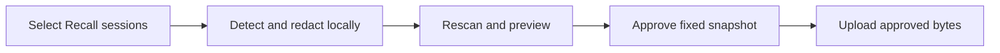

# Session Publishing

Status: planned feature, not implemented. This is the canonical design for
publishing Recall session datasets.

## Purpose

An optional Recall extension lets users select their sessions, remove sensitive
information locally, and publish a downloadable dataset under their own account.
Publishers control disclosure and privacy. Consumers handle interpretation,
quality filtering, analysis, and further processing.

## Content contract

Recall is the source of truth. Original content means the content available
through Recall's stable CLI JSON/JSONL protocol. Native harness files are outside
this feature's input boundary.

- Each JSONL record contains one session.
- Preserve available messages, tool calls and results, timestamps, ordering,
  usage, and relationships, subject to privacy redaction.
- Preserve failed attempts, repetition, corrections, and unfinished work.
- Do not summarize, rewrite, score, curate highlights, or discard sessions for
  perceived quality.
- Mark redactions and unavailable content explicitly. Do not manufacture missing
  evidence or imply that a redacted record is complete.

The public format has its own schema version, separate from the local backup
format. Consumers identify it from its declared schema rather than its filename.
Publishing does not change the core export/import contract or mutate the index.
The extension follows the [extension boundary](extensions.md#boundary).

## Selection and filenames

Session is the publication unit. The following dimensions select and organize
sessions using the same record format:

| Dimension | Meaning | Filename example |
| --- | --- | --- |
| Author | Explicit publisher attribution, never inferred from names in the transcript | `author-samzong.recall.jsonl` |
| Project | Repository identity across its worktrees | `project-samzong-recall.recall.jsonl` |
| Agent | Coding harness such as Codex, Claude Code, or Cursor; model is separate metadata | `agent-codex.recall.jsonl` |
| Time | A declared session selection interval | `time-2026-08.recall.jsonl` |
| Session | Explicit session inclusion and exclusion | User-selected scope name |

Combined dimensions intersect. Generated filenames follow
`<scope>.recall.jsonl`, with components ordered author, project, agent, then time:

```text
project-samzong-recall_agent-codex_time-2026-08.recall.jsonl
```

Users may customize the scope name. Dates describe the selection interval, not
the upload date. Exact selectors, timestamp semantics, and timezone belong in
the manifest; filenames are descriptive labels. Collections can reference the
same session identity without requiring separate copies for each dimension.

Project association and publisher attribution help select records. Neither
proves that every message or tool result is suitable for public disclosure.

## Privacy implementation

Reuse maintained detection and anonymization tools. Recall owns the format
adapter and publication workflow, without maintaining its own general secret
patterns or PII detection engine.

| Responsibility | Dependency | Integration |
| --- | --- | --- |
| Secret detection | [Gitleaks](https://github.com/gitleaks/gitleaks) | Use upstream rules and structured findings for credentials, tokens, and private keys |
| Personal information detection | [Presidio Analyzer](https://presidio.dataprivacystack.org/tutorial/05_languages/) with local NLP models | Configure recognizers and models for the supported languages |
| Text redaction | [Presidio Anonymizer](https://presidio.dataprivacystack.org/anonymizer/) | Replace or remove detected spans while retaining surrounding content |

The Rust extension invokes Gitleaks and a `uv`-isolated Python environment for
Presidio. Models are provisioned before scanning; session analysis runs locally,
without remote inference or a resident service. This adds Python and model
dependencies in exchange for reusing upstream detection capabilities.

The adapter extracts text from metadata, messages, tool arguments, and outputs,
including nested JSON payloads, and retains their session and field locations.
It converts Gitleaks findings to `RecognizerResult` spans using Presidio's text
coordinates and passes them with PII findings to Presidio Anonymizer for overlap
handling and redaction. Set `merge_entities_with_spaces=False` to preserve
whitespace between detected spans. The adapter maps the redacted text back to
its fields and serializes valid JSONL. Known local path substitutions and
explicitly public identity allowances are configuration passed to existing
mechanisms.

Gitleaks `--redact` hides secrets in scanner output; it does not modify the input
dataset. The adapter must connect secret findings to content redaction. Raw
findings and replacement mappings remain local and are excluded from published
artifacts.

Chinese support requires model and recognizer configuration plus validation on
mixed Chinese, English, and code. [spaCy Chinese models](https://spacy.io/models/zh)
are candidates, not evidence of sufficient detection on Recall sessions.
Internal decisions and customer context can leak without matching a secret or
PII pattern. A clean scan cannot establish zero disclosure risk.

## Publication workflow



Preview shows the selected scope, content changes, and unresolved findings.
Scan failures or unresolved findings prevent automatic publication. User approval
applies to the exact prepared content. New messages, changed redactions, or
changed selection require a fresh preview and approval; approval never follows
a live session as it grows.

The downloadable publication contains the JSONL data and `manifest.json` with
the public format version, publisher attribution, exact selection, file digests,
and redaction/coverage information. The manifest is subject to the same privacy
checks. File digests bind the reviewed content to the upload.

Hugging Face is the first destination, using the publisher's own account and
dataset. ModelScope is a later destination using the same prepared data bytes.
Destination credentials and upload receipts stay outside the session records.

## First delivery and verification

The first delivery covers selection, local privacy processing, preview,
approval, upload, and a verified download link. Automatic ongoing publication,
readers, summaries, quality rankings, editorial workflows, and simultaneous
multi-platform delivery are outside this delivery.

Acceptance must demonstrate:

- Project, author, agent, time, and explicit session selection produce the
  intended set without rewriting session content.
- Redaction reaches metadata and nested tool payloads, preserves valid JSONL,
  and leaves unrelated content intact.
- Known secret and PII examples are detected; mixed-language false positives
  and misses are measured and exposed as coverage limitations.
- Scan failures and changes after approval cannot silently reach publication.
- Downloaded data matches the approved file digests; local originals remain
  unchanged.

Before implementation, specify the public record fields, the timestamp used for
time selection, extension command names, and dependency/model versions here.
Publishers must choose the dataset's license and disclosure policy before a
real publication. This design does not establish scanner accuracy or a completed
implementation.
