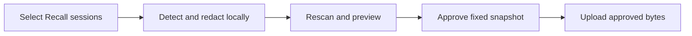

# Session Publishing

Status: implemented in `extensions/recall-publish`. This is the canonical
design for publishing Recall session datasets. Versions and field names below
were verified on 2026-09-18 against Recall protocol version 2, export record
schema version 7, and the upstream releases listed in
[Dependencies and versions](#dependencies-and-versions).

## Purpose

An optional Recall extension lets users select their sessions, remove sensitive
information locally, and publish a downloadable dataset under their own account.
Publishers control disclosure and privacy. Consumers handle interpretation,
quality filtering, analysis, and further processing.

## Content contract

Recall is the source of truth. Original content means the content available
through Recall's stable CLI JSON/JSONL protocol. Native harness files are outside
this feature's input boundary.

- Each JSONL record contains one session.
- Preserve available messages, tool calls and results, timestamps, ordering,
  usage, and relationships, subject to privacy redaction.
- Preserve failed attempts, repetition, corrections, and unfinished work.
- Do not summarize, rewrite, score, curate highlights, or discard sessions for
  perceived quality.
- Mark redactions and unavailable content explicitly. Do not manufacture missing
  evidence or imply that a redacted record is complete.

The public format has its own schema version, separate from the local backup
format. Consumers identify it from its declared schema rather than its filename.
Publishing does not change the core export/import contract or mutate the index.
The extension follows the [extension boundary](extensions.md#boundary).

## Selection and filenames

Session is the publication unit. The following dimensions select and organize
sessions using the same record format:

| Dimension | Meaning | Filename example |
| --- | --- | --- |
| Author | Explicit publisher attribution, never inferred from names in the transcript | `author-samzong.recall.jsonl` |
| Project | Repository identity across its worktrees | `project-samzong-recall.recall.jsonl` |
| Agent | Coding harness such as Codex, Claude Code, or Cursor; model is separate metadata | `agent-codex.recall.jsonl` |
| Time | A declared session selection interval | `time-2026-08.recall.jsonl` |
| Session | Explicit session inclusion and exclusion | User-selected scope name |

Combined dimensions intersect. Generated filenames follow
`<scope>.recall.jsonl`, with components ordered author, project, agent, then time:

```text
project-samzong-recall_agent-codex_time-2026-08.recall.jsonl
```

Users may customize the scope name. Dates describe the selection interval, not
the upload date. Exact selectors, timestamp semantics, and timezone belong in
the manifest; filenames are descriptive labels. Collections can reference the
same session identity without requiring separate copies for each dimension.

### Selectors and core commands

| Dimension | Extension flag | Core command |
| --- | --- | --- |
| Author | `--author <name>` (required, or `publisher.author` in config) | none; publisher attribution is extension input |
| Project | `--project <owner/repo \| remote URL \| path \| all>` | `recall export --project <selector>` |
| Agent | `--source <id>` repeatable | `recall export --source <id>` per source |
| Time | `--since <date>` and `--until <date>`, optional `--timezone <UTC \| ±HH:MM>` | filtered by the extension over `recall export --time all` |
| Session | `--session <id>` repeatable, `--exclude-session <id>` repeatable | `recall session export --id ...` |

Every core call passes an explicit project selector and
`--include metadata,messages,usage,events`; `recall session export` and
`recall export` emit byte-identical schema version 7 records. Combined
dimensions intersect: the extension runs the narrowest core query, then applies
the remaining selectors locally. Explicit `--session` selection is unioned with the
dimensional result, and `--exclude-session` is applied last. `--thread-role` is
passed through unchanged; the default keeps primary, subagent, and unknown
threads so `session.topology.parents` stays resolvable inside the dataset.

### Time selection

Time selection uses `session.started_at`, the only non-null session timestamp
in the export record. It is Unix epoch milliseconds in UTC, as are
`session.updated_at` and every `timestamp` on messages, usage events, and
events. The interval is half-open, `since <= started_at < until`.

`--since` and `--until` accept `YYYY-MM-DD` or RFC 3339. A bare date is
interpreted at midnight in `--timezone`, default `UTC`. A session that started
before `since` and continued into the interval is excluded; a session that
started inside the interval and continued past `until` is included in full.
Core `--time` only understands `today`, `7d`, `week`, `30d`, `month`, and
`all`, so the extension always requests `--time all` and filters locally; the
manifest records the resolved RFC 3339 bounds and timezone.

The `time-` filename component is `YYYY-MM` when the interval is exactly one
calendar month in the declared timezone, `YYYY-MM-DD` when it is exactly one
day, and `YYYYMMDD-YYYYMMDD` otherwise. Filenames never encode the timezone.

Project association and publisher attribution help select records. Neither
proves that every message or tool result is suitable for public disclosure.

## Public record format

The public format is `recall-session-dataset` version 1. Each JSONL line is one
record derived from one export record with schema version 7. Field meanings
are inherited from the export record unless stated here; consumers must not
assume the public schema and the export schema share version numbers.

```json
{
  "schema": { "name": "recall-session-dataset", "version": 1 },
  "source_schema_version": 7,
  "session": {
    "id": "…", "source": "codex", "source_id": "…",
    "title": "…", "custom_title": null, "summary": null,
    "repo": { "remote": "github.com/samzong/Recall", "slug": "samzong/Recall", "name": "Recall" },
    "started_at": 1756684800000, "updated_at": 1756688400000,
    "message_count": 42, "entrypoint": "cli", "duration_minutes": 60,
    "topology": { "thread_role": "primary", "parents": [] }
  },
  "messages": [ { "seq": 1, "role": "user", "timestamp": 1756684800000, "content": "…" } ],
  "usage_events": [ { "…": "export usage event without source_path" } ],
  "events": [ { "…": "export event without source_path; files[] without cwd, target.absolute_path, target.repo_root" } ],
  "redaction": {
    "status": "redacted",
    "spans": 3,
    "entities": { "GITHUB_PAT": 1, "EMAIL_ADDRESS": 2 },
    "fields": [ "/messages/7/content", "/events/12/attrs_json/input/command" ]
  },
  "unavailable": []
}
```

Rules:

- `session.id`, `session.source`, and `session.source_id` are copied verbatim;
  `session.id` is the cross-collection identity. `session.repo` groups
  `repo_remote`, `repo_slug`, and `repo_name`, and is `null` when the export
  record has no repository identity.
- Local filesystem locations are removed, never redacted: `session.directory`,
  `session.source_file_path`, `usage_events[].source_path`,
  `events[].source_path`, `events[].files[].cwd`,
  `events[].files[].target.absolute_path`, and
  `events[].files[].target.repo_root`. `files[].path` and
  `target.repo_relative_path` are retained and scanned as text.
- Every other export field is retained, including `messages[].content`,
  `events[].attrs_json`, `usage_events[].raw_usage_json`, `parser_version`,
  `visibility`, `is_meta`, and `command_evidence_status`. Tool calls and
  results live in `events[]`; the extension does not reconstruct them into
  messages.
- `attrs_json` and `raw_usage_json` stay JSON strings. The adapter parses them,
  scans every string leaf, and re-serializes compactly; a string that fails to
  parse is scanned as one text value.
- Redacted spans are replaced in place by `[REDACTED:<ENTITY_TYPE>]`, where
  `ENTITY_TYPE` is the Gitleaks rule id in upper snake case or the Presidio
  entity name. Surrounding text is unchanged.
- `redaction.status` is `clean` or `redacted`. `redaction.fields` lists RFC 6901
  JSON Pointers to every field that changed; pointers into `attrs_json` and
  `raw_usage_json` continue through the parsed payload. Offsets and original
  values are never published.
- `unavailable` names top-level arrays the local index could not provide
  (`usage_events`, `events`), so an empty array means "none observed" and a
  listed name means "not available".
- Field additions are compatible changes. Removing, renaming, or changing the
  meaning of a published field bumps `schema.version`.

The manifest is `recall-session-dataset-manifest` version 1:

```json
{
  "schema": { "name": "recall-session-dataset-manifest", "version": 1 },
  "dataset_schema": { "name": "recall-session-dataset", "version": 1 },
  "publisher": { "author": "samzong" },
  "license": "CC-BY-4.0",
  "selection": {
    "project": { "kind": "slug", "value": "samzong/Recall" },
    "sources": [ "codex" ],
    "thread_roles": [ "primary", "subagent", "unknown" ],
    "time": { "field": "session.started_at", "since": "2026-08-01T00:00:00Z", "until": "2026-09-01T00:00:00Z", "timezone": "UTC" },
    "session_ids": { "include": [], "exclude": [] }
  },
  "files": [
    { "path": "project-samzong-recall_agent-codex_time-2026-08.recall.jsonl", "sha256": "…", "bytes": 1234567, "sessions": 57 }
  ],
  "redaction": {
    "sessions_redacted": 12,
    "entities": { "GITHUB_PAT": 3, "EMAIL_ADDRESS": 9 },
    "languages": [ "en", "zh" ],
    "tools": { "gitleaks": "8.30.1", "presidio-analyzer": "2.2.364", "presidio-anonymizer": "2.2.364", "spacy": "3.8.16" },
    "models": [ "en_core_web_lg-3.8.0", "zh_core_web_lg-3.8.0" ],
    "coverage_notes": [ "Chinese PII detection measured on synthetic fixtures only" ]
  },
  "producer": { "recall": "0.6.0", "recall-publish": "0.1.0", "protocol_version": 2, "source_schema_version": 7 },
  "prepared_at": "2026-09-18T03:49:00Z"
}
```

`license` is an SPDX identifier chosen by the publisher; `prepare` fails
without one. `files[].sha256` is the digest of the exact bytes uploaded.

## Privacy implementation

Reuse maintained detection and anonymization tools. Recall owns the format
adapter and publication workflow, without maintaining its own general secret
patterns or PII detection engine.

| Responsibility | Dependency | Integration |
| --- | --- | --- |
| Secret detection | [Gitleaks](https://github.com/gitleaks/gitleaks) | Use upstream rules and structured findings for credentials, tokens, and private keys |
| Personal information detection | [Presidio Analyzer](https://presidio.dataprivacystack.org/tutorial/05_languages/) with local NLP models | Configure recognizers and models for the supported languages |
| Text redaction | [Presidio Anonymizer](https://presidio.dataprivacystack.org/anonymizer/) | Replace or remove detected spans while retaining surrounding content |

The Rust extension invokes Gitleaks and a `uv`-isolated Python environment for
Presidio. Models are provisioned before scanning; session analysis runs locally,
without remote inference or a resident service. This adds Python and model
dependencies in exchange for reusing upstream detection capabilities.

Scan pipeline per prepared file:

1. Extract every text leaf from the public record into a scan document with one
   JSON-escaped line per leaf, keyed by record index and JSON Pointer.
2. Run `gitleaks stdin --no-banner --report-format json --report-path - --exit-code 0`
   on the scan document. Each finding's `StartLine` maps back to a leaf;
   `Secret` locates the span inside the original leaf text, so column offsets
   of the escaped line are never trusted. `RuleID` becomes the entity type.
3. Run Presidio Analyzer on each leaf once per configured language (`en`, then
   `zh`) and union the spans; language detection is not attempted in v1.
4. Convert Gitleaks spans to `RecognizerResult` with score `1.0`, merge with
   analyzer results, and call `AnonymizerEngine.anonymize` with the `replace`
   operator, `new_value` set to the marker, and `merge_entities_with_spaces=False`.
5. Write the redacted leaf back to its pointer, re-serialize, and rescan the
   full output. The rescan must produce zero findings; any finding is
   unresolved and blocks approval.

Configuration lives in `<config_dir>/recall/publish.json`, the same directory
core and `recall-r2` use:

```json
{
  "schema": 1,
  "publisher": { "author": "samzong" },
  "languages": [ "en", "zh" ],
  "allow": {
    "identities": [ "samzong", "samzong@example.com" ],
    "gitleaks_rules": [],
    "presidio_entities": []
  },
  "path_substitutions": { "/Users/x/git": "~/git" }
}
```

`allow.identities` become Presidio allow-list entries; `allow.gitleaks_rules`
and `allow.presidio_entities` disable named rules or entity types for this
publisher and are recorded in `manifest.redaction.coverage_notes`.
`path_substitutions` are applied to leaf text before detection, so home
directories that survive inside command text or `attrs_json` become stable
relative prefixes rather than `[REDACTED:...]` markers. The config never stores
destination credentials.

### Entity policy

Stock Presidio is not sufficient for this dataset. Measured on 2026-09-18 with
`zh_core_web_lg` and `en_core_web_lg` 3.8.0:

- The `zh` registry carries 10 recognizers against 17 for `en`, and
  `CREDIT_CARD` is absent from `zh`. Analyzing each leaf in both languages and
  unioning the spans is required for coverage, not an optimization.
- A mainland mobile number matches `DATE_TIME` at 0.85 and `PHONE_NUMBER` at
  only 0.4, so a naive threshold keeps the number and a naive entity set
  redacts every date in every transcript.
- A mainland ID card number is detected by neither language.

The extension therefore fixes an entity policy rather than redacting whatever
the analyzer returns. Spans below score 0.5 are dropped. `DATE_TIME`, `NRP`,
`URL`, `ORGANIZATION`, `US_DRIVER_LICENSE`, `US_BANK_NUMBER`, and
`MEDICAL_LICENSE` are denied by default: on session transcripts they fire on
timestamps, code identifiers, and ordinary prose. `MEDICAL_LICENSE` is the
expensive one. Its US DEA pattern is two letters followed by seven digits,
which occurs inside ordinary Git commit hashes, so it silently rewrites the
middle of a hash and breaks every reference to that commit. Measured on
2026-09-18 over 200 real commit hashes from this repository, the stock policy
corrupted three of them.

Two `PatternRecognizer` entities are added for the gap the models leave,
`CN_ID_CARD` and `CN_PHONE_NUMBER`, registered for both languages.
`CN_PHONE_NUMBER` requires non-alphanumeric boundaries rather than non-digit
boundaries, because a mainland mobile pattern also occurs inside hexadecimal
hashes. With both corrections the same 200 commit hashes pass through
unchanged, and the remaining detections on technical text are a real IPv6
address, a real MAC address, and a genuine national-identifier shape. These are configuration of an existing mechanism, not a Recall
detection engine; no general secret or PII patterns are maintained here.

With that policy the measured fixture redacts Chinese names, mainland phone
numbers, ID cards, credit cards, email addresses, and IP addresses, and leaves
Rust source and ordinary Chinese prose untouched. Two limitations are known and
belong in `manifest.redaction.coverage_notes`: a Chinese street address is
detected only down to the city, and `PERSON` detection is context-dependent, so
a name inside a code literal can be missed. Neither is fixed by model choice
alone.

`PERSON` and `LOCATION` are not redacted by default. Measured on 2026-09-18
over two real Recall sessions from this repository, redacting them turned 1.2 MB
of public records into 3636 markers: 3391 `PERSON`, 222 `LOCATION`, 19
`IP_ADDRESS`, and 4 `EMAIL_ADDRESS`. The named entities were almost entirely
product and platform names such as `Claude`, `DeepSeek`, and `Linux`, because
spaCy assigns every NER span a fixed 0.85 score, so no threshold separates a
real name from a tool name. The resulting dataset is unreadable as technical
text, which defeats its purpose, so both entities ship in the default
`allow.presidio_entities` and the omission is disclosed in
`manifest.redaction.coverage_notes`. A publisher who needs named-entity
redaction sets `allow.presidio_entities` to an empty list and accepts the noise.

This default means a contributor name written in prose can reach the published
dataset. Gitleaks secrets and every pattern-backed entity, including email
addresses, IP addresses, credit cards, `CN_PHONE_NUMBER`, and `CN_ID_CARD`, are
redacted regardless of this setting, so the identifiers that carry real
consequence stay covered.

The adapter extracts text from metadata, messages, tool arguments, and outputs,
including nested JSON payloads, and retains their session and field locations.
It converts Gitleaks findings to `RecognizerResult` spans using Presidio's text
coordinates and passes them with PII findings to Presidio Anonymizer for overlap
handling and redaction. Set `merge_entities_with_spaces=False` to preserve
whitespace between detected spans. The adapter maps the redacted text back to
its fields and serializes valid JSONL. Known local path substitutions and
explicitly public identity allowances are configuration passed to existing
mechanisms.

Gitleaks `--redact` hides secrets in scanner output; it does not modify the input
dataset. The adapter must connect secret findings to content redaction. Raw
findings and replacement mappings remain local and are excluded from published
artifacts.

Chinese support requires model and recognizer configuration plus validation on
mixed Chinese, English, and code. [spaCy Chinese models](https://spacy.io/models/zh)
are candidates, not evidence of sufficient detection on Recall sessions.
Internal decisions and customer context can leak without matching a secret or
PII pattern. A clean scan cannot establish zero disclosure risk.

## Publication workflow



Preview shows the selected scope, content changes, and unresolved findings.
Scan failures or unresolved findings prevent automatic publication. User approval
applies to the exact prepared content. New messages, changed redactions, or
changed selection require a fresh preview and approval; approval never follows
a live session as it grows.

The downloadable publication contains the JSONL data and `manifest.json` with
the public format version, publisher attribution, exact selection, file digests,
and redaction/coverage information. The manifest is subject to the same privacy
checks. File digests bind the reviewed content to the upload.

Hugging Face is the first destination, using the publisher's own account and
dataset. ModelScope is a later destination using the same prepared data bytes.
Destination credentials and upload receipts stay outside the session records.

### Progress reporting

`prepare` is the only long-running command. It writes one line per phase to
stderr, and in a terminal it overwrites a single line with a field counter
during redaction, which is the slow phase and the one that loads the language
models. stdout carries the JSON result alone so the command stays pipeable, and
`--quiet` silences stderr. Measured on 2026-09-18, two sessions of roughly 3000
text fields take about 80 seconds, almost all of it in the Python analyzer.

### Extension commands and local state

The extension is `recall-publish`, dispatched as `recall publish`, with
manifest `{"name":"publish","protocol":2,"min_recall":"0.6.0"}`.
It reads the core binary from `RECALL_BIN` (default `recall` on `PATH`) like
`recall-reflect`.

| Command | Effect | Exit non-zero when |
| --- | --- | --- |
| `recall publish doctor` | Verifies Gitleaks, `uv`, the Python environment, models, and `hf`; provisions the environment and models with `--install` | any dependency is missing or below the pinned version |
| `recall publish prepare <selectors> --license <spdx> [--scope-name <name>] [--format json]` | Exports, transforms, redacts, rescans, writes the workspace, and prints the preview | export fails, a scan fails, or the rescan reports findings |
| `recall publish approve <scope>` | Recomputes digests, confirms the rescan record is clean, and writes `approval.json` | the workspace changed since `prepare`, or findings are unresolved |
| `recall publish upload <scope> --repo <namespace/dataset> [--private]` | Verifies digests against `approval.json`, uploads the data and manifest, downloads them back, and prints the verified URL | digests mismatch, upload fails, or the downloaded bytes differ |

Workspace layout under `<data_dir>/recall/publish/<scope>/`:

```text
<scope>.recall.jsonl     public data, the exact bytes uploaded
manifest.json            public manifest
preview.json             scope, counts, per-session redaction summary
findings.local.json      raw scanner findings and replacement map; never uploaded
approval.json            sha256 of every public file plus the approving timestamp
receipt.json             destination URL, revision, and upload timestamp
```

`prepare` on an existing scope replaces the workspace and deletes any
`approval.json`, so changed selection, new messages, or changed redactions
always require a fresh approval. `upload` refuses a workspace whose digests do
not match `approval.json`. `preview.json` and `findings.local.json` are local
state; `receipt.json` is written after a verified download.

Upload uses `hf upload <repo> <workspace> . --repo-type dataset` from the same
`uv` environment. Authentication comes from `HF_TOKEN` or the token store
written by `hf auth login`; the extension never reads, writes, or prints the
token. Verification downloads every uploaded file from the resulting revision
and compares digests with `approval.json`.

## Dependencies and versions

| Dependency | Pinned | Provisioning |
| --- | --- | --- |
| Gitleaks | 8.30.1 minimum, `gitleaks version` checked by `doctor` | user-installed on `PATH` (`brew install gitleaks`); the extension does not download binaries |
| `uv` | 0.12 or later | user-installed on `PATH` |
| Python | 3.12 | `uv` managed, declared in the embedded project |
| `presidio-analyzer`, `presidio-anonymizer` | 2.2.364 | `uv.lock` embedded in `extensions/recall-publish/python/` |
| `spacy` | 3.8.16 | same lock |
| `en_core_web_lg`, `zh_core_web_lg` | 3.8.0 | wheel URLs pinned in the same lock; `doctor --install` downloads them |
| `huggingface_hub[cli]` | 1.32.0 | same lock, provides `hf` |

The Python project is embedded in the extension crate and materialized into
`<data_dir>/recall/publish/env/` by `doctor --install`; `prepare` runs
`uv run --project <that dir>` and refuses to scan when the lock hash differs
from the embedded one. `manifest.redaction.tools` and `models` are read from
the live environment, not from this table. `zh_core_web_trf` is the measured
fallback if `zh_core_web_lg` misses PII in the acceptance fixtures; switching
models is a coverage change recorded in the manifest, not a format change.

## First delivery and verification

The first delivery covers selection, local privacy processing, preview,
approval, upload, and a verified download link. Automatic ongoing publication,
readers, summaries, quality rankings, editorial workflows, and simultaneous
multi-platform delivery are outside this delivery.

Acceptance must demonstrate:

- Project, author, agent, time, and explicit session selection produce the
  intended set without rewriting session content.
- Redaction reaches metadata and nested tool payloads, preserves valid JSONL,
  and leaves unrelated content intact.
- Known secret and PII examples are detected; mixed-language false positives
  and misses are measured and exposed as coverage limitations.
- Scan failures and changes after approval cannot silently reach publication.
- Downloaded data matches the approved file digests; local originals remain
  unchanged.

Verification lives in the extension crate. Fixture export records under
`extensions/recall-publish/tests/fixtures/` contain synthetic secrets and
English and Chinese PII in messages, `attrs_json`, `raw_usage_json`, and
`files[].path`; a fake `recall` supplied through `RECALL_BIN` serves them.
Rust tests cover selection, field removal, pointer mapping, approval binding,
and digest verification. Scanner tests run through the real `uv` environment
and are skipped with a visible notice when `doctor` fails, so CI without the
environment cannot report false coverage. The first real upload targets a
throwaway private dataset owned by the publisher.

Publishers must choose the dataset's license and disclosure policy before a
real publication. This design does not establish scanner accuracy or a completed
implementation.
